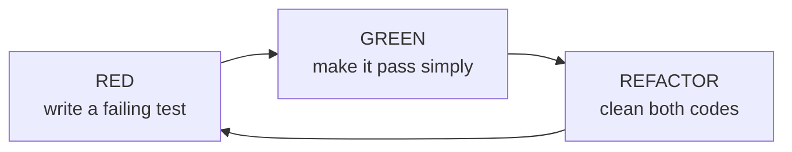

# Red, Green, Refactor

## TL;DR

- Start by listing the tests you intend to write - sequencing is a skill.
- **Red:** write one small failing test and watch it fail for the right reason.
- **Green:** make it pass with the simplest possible code; "cheating" is allowed temporarily.
- **Refactor:** clean both test and production code while staying green.
- The walkthrough below shows three full cycles in TypeScript (Vitest) and Python (pytest).



## Step 0 - the test list

Before the first cycle, enumerate the tests you plan to write. Fowler calls
this a vital initial step: pick the test that drives you fastest toward the
salient design points, and keep adding to the list as ideas occur.

Example task: a string-based calculator (`add(numbers: string): int`) with
these requirements:

1. `add("")` returns `0`
2. `add("1")` returns `1`
3. `add("1,2")` returns `3` - comma is the separator
4. Newlines also separate numbers: `"1\n2,3"` returns `6`
5. Custom delimiters: `"//;\n1;2"` returns `3`
6. Negative numbers throw an error listing them

We start with tests 1-3 in this walkthrough.

## Cycle 1 - empty string returns zero

**Red.** Write exactly one test:

```ts
import { describe, expect, it } from "vitest";
import { add } from "./stringCalculator";

describe("add", () => {
  it("returns 0 for an empty string", () => {
    expect(add("")).toBe(0);
  });
});
```

```python
from string_calculator import add


def test_empty_string_returns_zero():
    assert add("") == 0
```

Run the suite. It fails - the module does not even exist. That failure _is_
progress: the test now exists and expresses intent.

**Green.** The simplest passing implementation:

```ts
export function add(numbers: string): number {
  return 0;
}
```

```python
def add(numbers: str) -> int:
    return 0
```

This looks like cheating - and at this stage, it is the correct move. Beck's
guidance: fake it until you have a reason not to.

**Refactor.** Nothing worth improving yet. Move on.

## Cycle 2 - single number returns itself

**Red.**

```ts
it("returns the number itself for a single number", () => {
  expect(add("7")).toBe(7);
});
```

```python
def test_single_number_returns_itself():
    assert add("7") == 7
```

Fails: `add("7")` returns 0.

**Green.** Minimal generalization:

```ts
export function add(numbers: string): number {
  if (numbers === "") return 0;
  return Number(numbers);
}
```

```python
def add(numbers: str) -> int:
    if numbers == "":
        return 0
    return int(numbers)
```

**Refactor.** The two branches read fine. Continue.

## Cycle 3 - comma-separated sum

**Red.**

```ts
it("sums two comma-separated numbers", () => {
  expect(add("1,2")).toBe(3);
});
```

```python
def test_sums_two_comma_separated_numbers():
    assert add("1,2") == 3
```

Fails: `Number("1,2")` / `int("1,2")` throws.

**Green.** Split and sum:

```ts
export function add(numbers: string): number {
  if (numbers === "") return 0;
  return numbers
    .split(",")
    .map(Number)
    .reduce((a, b) => a + b, 0);
}
```

```python
def add(numbers: str) -> int:
    if numbers == "":
        return 0
    return sum(int(part) for part in numbers.split(","))
```

All previous tests still pass - that is the safety net working.

**Refactor.** Now there is something to improve: the empty-string special case
can be folded into the general path.

```ts
export function add(numbers: string): number {
  const parts = numbers === "" ? [] : numbers.split(",");
  return parts.map(Number).reduce((a, b) => a + b, 0);
}
```

```python
def add(numbers: str) -> int:
    parts = numbers.split(",") if numbers else []
    return sum(int(part) for part in parts)
```

Behavior unchanged, all green, design slightly cleaner. This is the third step
Fowler calls the most commonly neglected one - skipping it turns TDD into
"tests-first spaghetti".

## Strategies for getting to green

Kent Beck describes three legitimate strategies:

| Strategy               | When to use                                                            |
| ---------------------- | ---------------------------------------------------------------------- |
| Fake it                | Return a hardcoded value; generalize only when the next test forces it |
| Obvious implementation | When the implementation is trivially known, just write it              |
| Triangulation          | Two or more examples whose only common solution is the real rule       |

## What counts as "red"

A compile/import/type error is a valid red state. The cycle's requirement is
that you never write production code without a test demanding it.

## Common mistakes at this stage

- Writing several tests before going green - see [Common Pitfalls](common-pitfalls.md)
- Refactoring while red (fix the test first, then clean up)
- Implementing requirement 6 (negatives throw) while still on requirement 1

## References

- [Martin Fowler - Test Driven Development](https://martinfowler.com/bliki/TestDrivenDevelopment.html)
- Kent Beck, _Test-Driven Development: By Example_ - see [Reading List](../06-resources/reading-list.md)
- Original kata: [Roy Osherove - String Calculator Kata](https://osherove.com/tdd-kata-1)
