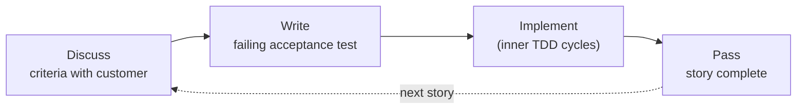

# ATDD - Acceptance Test-Driven Development

## TL;DR

- ATDD writes acceptance-level tests **with the customer** before development starts.
- The loop: discuss acceptance criteria → write failing acceptance test → implement → test passes → story done.
- ATDD is TDD's outer loop; BDD is its conversation-rich sibling.
- Its core value is scope control: a story is finished exactly when its acceptance tests pass.

## Definition

Acceptance Test-Driven Development brings the test-first discipline to the
story level. Before implementation, the team and customer specify acceptance
tests that describe what "done" means for the story in observable, business
terms. Development then proceeds - usually with inner [TDD](../01-tdd/fundamentals.md)
cycles - until those tests pass.

The Agile Alliance frames it as a collaborative practice where acceptance
criteria become executable tests rather than prose on a ticket.

## The workflow



1. **Discuss.** For the story "premium customers get 10% off", agree examples:
   premium pays 90 for 100; standard pays 100; discount applies before shipping.
2. **Write.** Encode one example as an automated acceptance test (failing).
3. **Implement.** Drive the code with unit-level TDD until the acceptance test goes green.
4. **Done** = acceptance suite green for all agreed examples.

## A minimal acceptance test

```python
def test_premium_customer_receives_ten_percent_discount():
    checkout = Checkout.for_customer(tier="premium")
    payable = checkout.total(cart_total=100)
    assert payable == 90


def test_standard_customer_pays_full_price():
    checkout = Checkout.for_customer(tier="standard")
    assert checkout.total(cart_total=100) == 100
```

```ts
it("gives premium customers a 10 percent discount", () => {
  const checkout = Checkout.forCustomer({ tier: "premium" });
  expect(checkout.total({ cartTotal: 100 })).toBe(90);
});
```

Note these operate at the application API level, not through UI clicks -
acceptance tests should be fast enough to run per story.

## ATDD vs BDD vs TDD

|            | TDD             | ATDD                        | BDD                                 |
| ---------- | --------------- | --------------------------- | ----------------------------------- |
| Level      | Unit            | Story/acceptance            | Story/behavior + discovery practice |
| Written by | Developer       | Dev + QA + customer         | Whole team                          |
| Format     | Code            | Executable acceptance tests | Examples, often Gherkin             |
| Emphasis   | Design feedback | Scope/done criteria         | Shared understanding                |

In practice the boundaries blur: a team doing BDD automation is functionally
doing ATDD with Gherkin syntax. See the [comparison matrix](overview.md).

## Benefits

- **Scope control.** Unagreed behavior is out of scope by construction; scope creep becomes visible as new acceptance tests.
- **Definition of Done with teeth.** "Tests pass" replaces "looks finished".
- **Fewer rejected stories.** Ambiguity surfaces during discussion, not at demo time.

## Pitfalls

- Acceptance tests coupled to UI selectors - brittle and slow; prefer application-level APIs.
- Tests written _by developers alone_ after the fact - that loses the customer collaboration, which is the point.
- Treating every edge case as acceptance-level; keep the acceptance suite small, push detail down to unit tests ([Test Pyramid](../03-testing-foundations/test-pyramid.md)).

## Tooling

Historically FitNesse and Robot Framework; modern stacks often express
acceptance tests directly in pytest/Vitest suites or via BDD tools when
business-readable format matters ([BDD](bdd.md)).

## References

- [Agile Alliance - ATDD glossary entry](https://www.agilealliance.org/glossary/atdd/)
- Gojko Adzic, _Specification by Example_ - see [Reading List](../06-resources/reading-list.md)
