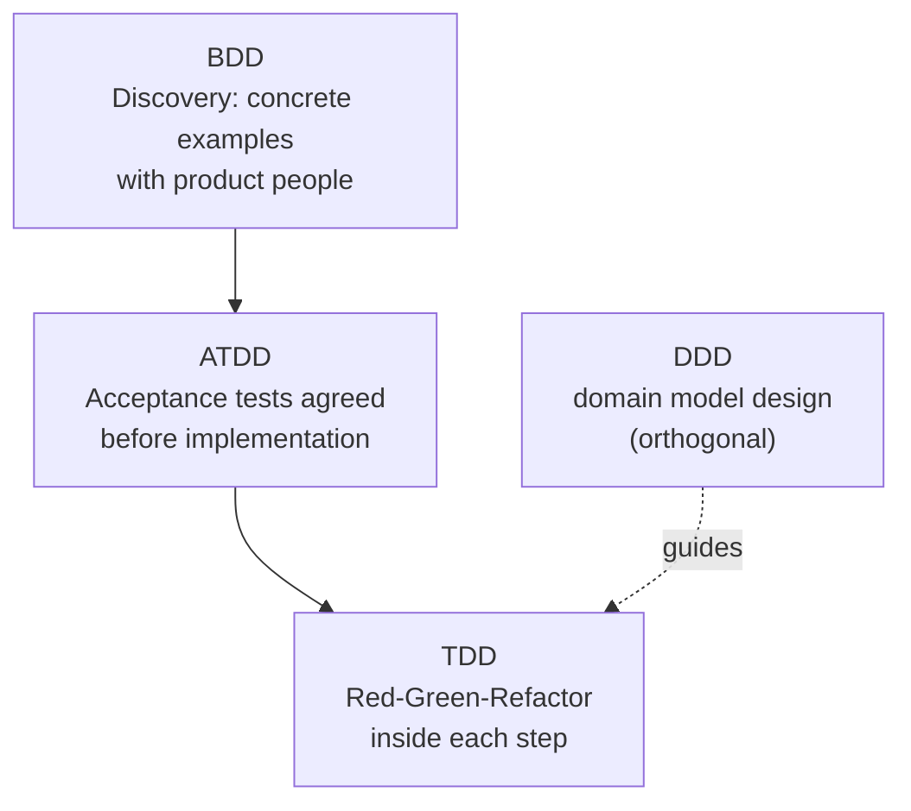

# Methodologies Overview & Comparison

## TL;DR

- TDD, BDD, and ATDD are all "test-first" feedback loops at different conversation levels.
- DDD is not a testing practice - it is a design approach that pairs naturally with them.
- They compose rather than compete: many teams use BDD for discovery, TDD inside each scenario, DDD for model structure.
- Job ads signal them differently: TDD broadly, BDD in QA-automation and some backend roles, DDD in senior/architect roles.

## The landscape

## Comparison matrix

| Dimension            | TDD                                             | BDD                                            | ATDD                                    | DDD                                                  |
| -------------------- | ----------------------------------------------- | ---------------------------------------------- | --------------------------------------- | ---------------------------------------------------- |
| Primary goal         | Design + verification through unit-level cycles | Shared understanding through concrete examples | Acceptance criteria agreed before build | Code that mirrors the business domain                |
| Unit of work         | One unit test                                   | One scenario/example                           | One acceptance test                     | One bounded context model                            |
| Key artifact         | Test suite                                      | Executable specifications (Gherkin)            | Acceptance test suite                   | Domain model + ubiquitous language                   |
| Who participates     | Developer                                       | Whole team (Three Amigos)                      | Customer + dev + QA                     | Domain experts + developers                          |
| Feedback loop length | Seconds-minutes                                 | Hours (workshop → automation)                  | Hours-days                              | Weeks (model evolution)                              |
| Typical tools        | Vitest, Jest, pytest, JUnit                     | Cucumber, SpecFlow, Behave                     | FitNesse, Robot Framework               | None required; tactical-pattern support in libraries |
| Job-ad signal        | Very common, most dev roles                     | QA automation, some backend                    | Less common by name                     | Senior/architect, domain-heavy products              |

## How they compose in practice

A typical flow on a BDD-mature team:

1. **Discovery workshop** (BDD): product, dev, and QA agree on concrete examples for the story.
2. **Formulation**: examples written as Gherkin scenarios; ambiguous ones bounce back to conversation.
3. **Automation**: each scenario step maps to test code; inside the step implementations, developers work in TDD cycles.
4. **Design**: where the domain is complex, DDD tactical patterns (entities, aggregates) shape what the units are - see [DDD](ddd.md).

Teams without BDD tooling still get most of the value by writing acceptance
criteria as examples before development starts - that is ATDD in essence, see
[ATDD](atdd.md).

## Choosing what to adopt

| Situation                                            | Sensible default                                                  |
| ---------------------------------------------------- | ----------------------------------------------------------------- |
| Solo dev or small team, no product owner in the loop | TDD + a lightweight test list                                     |
| Frequent misunderstandings about requirements        | Add BDD discovery conversations before adding any Gherkin tooling |
| Formal acceptance criteria per story                 | ATDD-style acceptance tests                                       |
| Complex, evolving business domain                    | DDD strategic design first, tactical patterns where they pay off  |

Adoption order matters: BDD tooling without discovery conversations produces
expensive, brittle scenario suites that nobody reads.

## References

- [Cucumber - Behaviour-Driven Development](https://cucumber.io/docs/bdd/)
- [Martin Fowler - Test Driven Development](https://martinfowler.com/bliki/TestDrivenDevelopment.html)
- [Agile Alliance glossary](https://www.agilealliance.org/glossary/tdd/)
