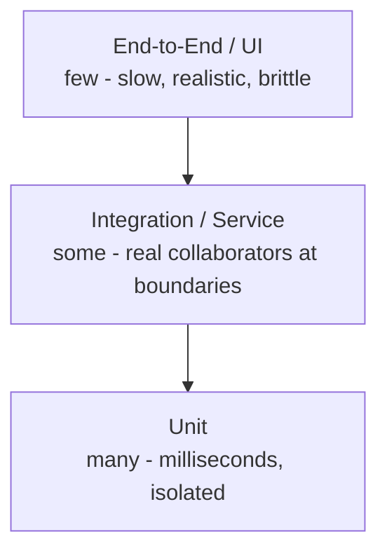

# The Test Pyramid

## TL;DR

- Mike Cohn's model: many fast unit tests, fewer integration tests, few end-to-end tests.
- The shape follows cost and latency: the higher the layer, the slower and more brittle the tests.
- Anti-patterns: the ice-cream cone (E2E-heavy) and the hourglass (thin middle).
- The "testing trophy" variant weights integration tests higher in modern JS/TS apps.
- Distribution is a budget decision enforced in CI - see [TDD in CI/CD](../04-engineering-culture/tdd-in-cicd.md).

## The model

## Layer responsibilities

| Layer       | Verifies                                               | Speed           | Typical count      | Fails when                 |
| ----------- | ------------------------------------------------------ | --------------- | ------------------ | -------------------------- |
| Unit        | One unit's logic in isolation                          | < 100 ms each   | Hundreds-thousands | Logic is wrong             |
| Integration | Components together: service + DB, HTTP handlers + app | 0.1-2 s each    | Tens-hundreds      | Wiring/contracts are wrong |
| E2E         | User journeys through the deployed system              | Seconds-minutes | A handful          | The product is unusable    |

The pyramid's logic: push verification as far down as it still catches the
defect class. A wrong discount calculation is caught in milliseconds by a unit
test; a broken checkout flow needs an E2E test - but only one or two.

## Anti-patterns

**Ice-cream cone** - mostly E2E tests. Symptoms: hours-long CI, flaky builds,
defects found late despite huge test counts. Usually the residue of QA-only
automation without developer testing. Fix by pushing checks down the layers.

**Hourglass** - many unit tests and many E2E tests with almost no integration
layer. Unit tests mock everything (so wiring is unverified) and E2E picks up
the slack. Fix with a real integration layer: database-backed repository tests,
contract tests, HTTP handler tests against the real app instance.

**Snow cone / inverted emphasis** - everything is called a "unit test" but
requires network or database; the suite is slow and order-dependent. Fix by
enforcing the [FIRST](../01-tdd/best-practices.md) properties at the unit layer.

## The testing trophy

Kent C. Dodds proposed that for typical web frontends, most confidence per
millisecond comes from integration tests (rendered component + real store +
mocked network), with static typing as the base of the trophy and unit/E2E as
the smaller top and bottom. The takeaway is not "pyramid wrong" - it is
"distribution should follow where your stack's defects actually live".

## Practical distribution guidance

1. Start with unit tests for all domain/business logic (TDD territory).
2. Add integration tests for every real boundary: persistence, HTTP, queues.
3. Reserve E2E for 3-10 critical revenue/user journeys.
4. Enforce layer budgets in CI: e.g., unit < 10 s total, integration < 2 min,
   E2E < 15 min - tune to your product.

## References

- [Martin Fowler - TestPyramid](https://martinfowler.com/bliki/TestPyramid.html)
- [Kent C. Dodds - The Testing Trophy and Test Classifications](https://kentcdodds.com/blog/the-testing-trophy-and-testing-classifications)
- [Google Testing Blog - Just Say No to More End-to-End Tests](https://testing.googleblog.com/2015/04/just-say-no-to-more-end-to-end-tests.html)
