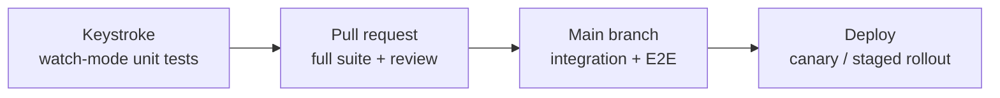

# TDD in CI/CD Pipelines

## TL;DR

- TDD provides the fast inner feedback loop; CI/CD scales it to every commit and deployment.
- Layer budgets (unit seconds, integration minutes, E2E tens of minutes) keep the pipeline trustworthy.
- Coverage gates work when they prevent regressions, not when they mandate a vanity number.
- Flaky tests are a production incident for your pipeline - quarantine fast, fix faster.
- Trunk-based development + TDD + fast pipelines is the standard modern delivery pattern.

## How the loops nest



| Loop                                                                                             | Feedback                | Owner                   |
| ------------------------------------------------------------------------------------------------ | ----------------------- | ----------------------- |
| Watch mode ([red-green-refactor](../01-tdd/red-green-refactor.md))                               | Seconds                 | Developer, continuously |
| PR check: full unit suite, lint, coverage delta                                                  | Minutes                 | Every pull request      |
| Post-merge: integration + E2E layers of the [pyramid](../03-testing-foundations/test-pyramid.md) | Minutes-tens of minutes | Main branch             |
| Deployment verification: smoke tests, canary metrics                                             | Continuous              | Release automation      |

## Pipeline stage design

```yaml
# Illustrative ordering - keep the cheap stages first
stages:
  - lint # markdownlint/prettier equivalents for code; seconds
  - unit # full unit suite; budget: < 60 s
  - build # compile/bundle once, reuse artifact
  - integration # real DB/queue via containers; budget: < 5 min
  - e2e # critical journeys only; budget: < 15 min
```

Principles:

- Fail fast: a broken import shouldn't wait behind a 20-minute E2E run.
- Parallelize within stages (`pytest-xdist -n auto`, Vitest sharding).
- Cache dependencies and builds between stages.

## Coverage policy that works

| Rule                                                  | Rationale                                                                              |
| ----------------------------------------------------- | -------------------------------------------------------------------------------------- |
| Coverage must not **decrease** on touched code        | Prevents silent erosion without mandating global numbers                               |
| Bug fixes require the reproducing test in the same PR | Codifies [test-driven bug fixing](../01-tdd/skill-levels.md)                           |
| Critical modules carry explicit higher thresholds     | Effort follows risk                                                                    |
| No gate on total-project percentage alone             | Percentages don't measure assertion quality ([pitfalls](../01-tdd/common-pitfalls.md)) |

## Flaky test protocol

A flaky test breaks the trust the whole system depends on. Standard protocol:

1. Auto-retry at most once (to distinguish noise from breakage) - retries hide problems if permanent.
2. Quarantine failing-unreliably tests out of the blocking path within a day.
3. Fix or delete within the sprint; quarantine longer than two weeks means the process has failed.
4. Track flakiness rate as a pipeline health metric.

## Trunk-based development and TDD

Short-lived branches merged into trunk daily pair naturally with TDD: each
cycle's green state is a mergeable increment, and CI verifies continuously.
Feature flags decouple _deploying_ incomplete-but-tested increments from
_releasing_ them. See [trunkbaseddevelopment.com](https://trunkbaseddevelopment.com).

## Why leadership cares: DORA

The DORA research program links fast, reliable delivery practices - including
automated testing and continuous integration - to organizational performance
(deployment frequency, lead time, change-failure rate, recovery time). A
healthy test-first culture is measurable infrastructure, not developer
aesthetics. See [dora.dev](https://dora.dev) and _Accelerate_ in the
[Reading List](../06-resources/reading-list.md).

## References

- [Atlassian - Agile software development](https://www.atlassian.com/agile/software-development)
- [Martin Fowler - TestPyramid](https://martinfowler.com/bliki/TestPyramid.html)
- Jez Humble & David Farley, _Continuous Delivery_ - see [Reading List](../06-resources/reading-list.md)
